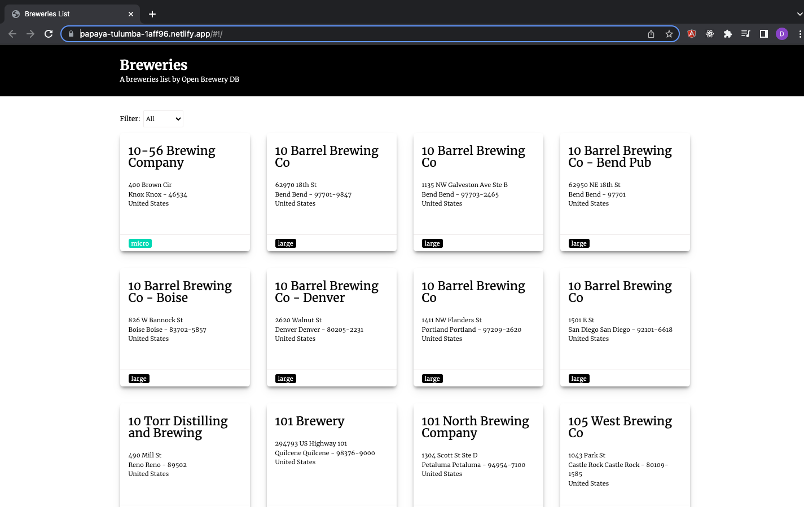

# Breweries List

## What's it?
This's a Breweries List project. This was built with AgularJS and Sass.

## Main concepts:
Services, directives, filters and components.

## Sample view:

## Requirements:
1. `node 8.x or 10.x`
2. `npm 6.4.1`
3. `gulp 3.9.1`

## Running the project (locally):

1. `cd breweries-list`
2. `npm i`
3. `npm run dev`
